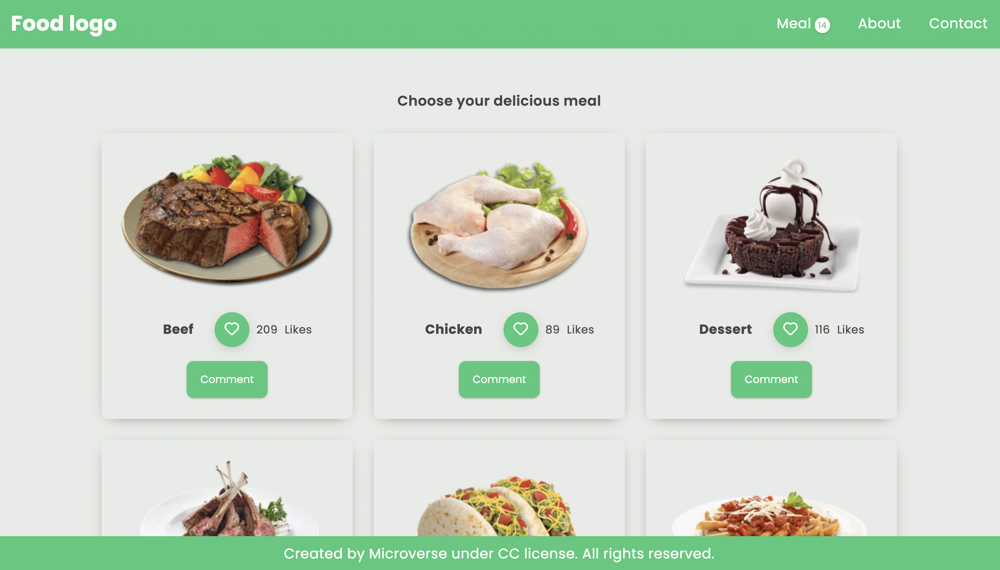

<div align="center">

  
  <br/>

  <h3><b>Microverse README Template</b></h3>

</div>

<!-- TABLE OF CONTENTS -->

# 📗 Table of Contents

- [📖 About the Project](#about-project)
  - [🛠 Built With](#built-with)
    - [Tech Stack](#tech-stack)
    - [Key Features](#key-features)
  - [🚀 Live Demo](#live-demo)
- [💻 Getting Started](#getting-started)
  - [Setup](#setup)
  - [Prerequisites](#prerequisites)
  - [Install](#install)
  - [Usage](#usage)
  - [Run tests](#run-tests)
  - [Deployment](#triangular_flag_on_post-deployment)
- [👥 Authors](#authors)
- [🔭 Future Features](#future-features)
- [🤝 Contributing](#contributing)
- [⭐️ Show your support](#support)
- [🙏 Acknowledgements](#acknowledgements)
- [❓ FAQ](#faq)
- [📝 License](#license)

<!-- PROJECT DESCRIPTION -->

# 📖 Food App <a name="about-project"></a>

Food App is a JavaScript capstone group project about building our own web application based on an external API. We selected the MEALDB API that provides meal category data for our Food App and built the webapp around it. This app allows the user to see various kinds of meal categories with the functionalities of like and comment features.

## 🛠 Built With <a name="built-with"></a>

### Tech Stack <a name="tech-stack"></a>

- HTML

- CSS

- Javascript

- Webpack

- API

- Lighthouse (An open-source, automated tool for improving the quality of web pages. It has audits for performance, accessibility, progressive web apps, SEO and more).

- Webhint (A customizable linting tool that helps you improve your site's accessibility, speed, cross-browser compatibility, and more by checking your code for best practices and common errors).

- Stylelint (A mighty, modern linter that helps you avoid errors and enforce conventions in your styles).


<!-- Features -->

### Key Features <a name="key-features"></a>

- **The users are able to read details about various meals**
- **The users are able to like the meals**
- **The users are able to leave comments**

<p align="right">(<a href="#readme-top">back to top</a>)</p>

<!-- LIVE DEMO -->

## 🚀 Live Demo <a name="live-demo"></a>

Please use the following link to access the website:
- [Live Demo Link](https://kismoilov.github.io/JS-Capstone-Project/)

<div align="center">

  
  <br/>

</div>

<p align="right">(<a href="#readme-top">back to top</a>)</p>

## 🚀 Project Details 

- [Kanban Board](https://github.com/KIsmoilov/JS-Capstone-Project/projects/1)
     
## 🚀 Pull Requests

- [Soe Sandar Win](https://github.com/KIsmoilov/JS-Capstone-Project/pull/22)

- [Khusniddin Ismoilov](https://github.com/KIsmoilov/JS-Capstone-Project/pull/23)


<!-- GETTING STARTED -->

## 💻 Getting Started <a name="getting-started"></a>

To get a local copy up and running, follow these steps.

### Prerequisites

- Have a local version control like Git. Which is a open source distributed version control system designed for source code management
- A text editor (e.g Visual Studio Code, Vim, Atom & Sublime.)
- A web browser (e.g Chrome, Safari, Mozilla Firefox.)
- Live Server which is a web extension that helps you to live reload feature for dynamic content (PHP, Node.js, ASPNET)
- Download waves to check project accessibilty

### Setup

1. Clone the repo by running the command
   ```sh
    git clone https://github.com/KIsmoilov/JS-Capstone-Project.git
   ```

### Install

Install this project with:

2. Open the directory of the project
   ```sh
   cd JS-Capstone-Project
   ```
3. Open the directory of the src
   ```sh
   cd src
   ```
4. Open the index.html file
   ```sh
   Click and open the index.html file
   ```

### Usage

To run the project, execute the following command:

5. Please run the following to render on the browser
   ```sh
   npm start
   ```

### Run tests

To run tests, run the following command:

6. Please run the following to test
   ```sh
   npm run test
   ```

### Deployment

You can deploy this project using:

7. Please run the following to deploy
   ```sh
   npm run deploy
   ```

<p align="right">(<a href="#readme-top">back to top</a>)</p>

<!-- AUTHORS -->

## 👥 Authors <a name="authors"></a>

👤 Khusniddin Ismoilov

- GitHub: [@KIsmoilov](https://github.com/KIsmoilov)
- LinkedIn: [LinkedIn](https://www.linkedin.com/in/khusniddin-ismoilov-185575157/)


👤 Soe Sandar Win

- GitHub: [@soesandarwin2201](https://github.com/soesandarwin2201)
- LinkedIn: [LinkedIn](https://www.linkedin.com/in/soe-sandar-win-softwareengineer/)

<p align="right">(<a href="#readme-top">back to top</a>)</p>

<!-- FUTURE FEATURES -->

## 🔭 Future Features <a name="future-features"></a>

- [ ] **The user will be able to make reservations to the restaurant**
- [ ] **The user will be able to add the food to the favorite list**
- [ ] **The user will be able to order the food**

<p align="right">(<a href="#readme-top">back to top</a>)</p>

<!-- CONTRIBUTING -->

## 🤝 Contributing <a name="contributing"></a>

- Contributions, issues, and feature requests are welcome!

- Feel free to check the [issues page](https://github.com/KIsmoilov/JS-Capstone-Project/issues).

<p align="right">(<a href="#readme-top">back to top</a>)</p>

<!-- SUPPORT -->

## ⭐️ Show your support <a name="support"></a>

- Give a ⭐️ if you like this project!

<p align="right">(<a href="#readme-top">back to top</a>)</p>

<!-- ACKNOWLEDGEMENTS -->

## 🙏 Acknowledgments <a name="acknowledgements"></a>

- We would like to thank [TheMealDB](https://www.themealdb.com/api.php) for using thier free API in this project

<p align="right">(<a href="#readme-top">back to top</a>)</p>

<!-- FAQ (optional) -->

## ❓ FAQ <a name="faq"></a>

- **How can I find the node modules folder?**

  - The node modules folder was added to the gitignore file, so you need to install it manually
  
  Please run the following to install node modules
   ```sh
   npm install
   ```


- **Which index.html file should I open to make some changes in src folder or dist folder?**

  - Please make change only to Html, CSS and JS files in the src directory

<p align="right">(<a href="#readme-top">back to top</a>)</p>

<!-- LICENSE -->

## 📝 License <a name="license"></a>

This project is [MIT](./LICENSE) licensed.

_NOTE: we recommend using the [MIT license](https://choosealicense.com/licenses/mit/) - you can set it up quickly by [using templates available on GitHub](https://docs.github.com/en/communities/setting-up-your-project-for-healthy-contributions/adding-a-license-to-a-repository). You can also use [any other license](https://choosealicense.com/licenses/) if you wish._

<p align="right">(<a href="#readme-top">back to top</a>)</p>